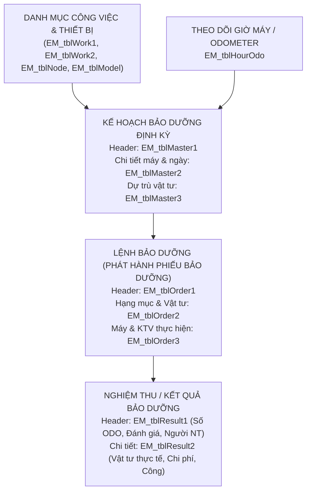

# TÀI LIỆU CẤU TRÚC CƠ SỞ DỮ LIỆU BẢO DƯỠNG THIẾT BỊ (PHÂN HỆ EM)

> **Cập nhật:** 2026-09-15  
> **Hệ thống:** ERP Quản trị Thiết bị & Bảo dưỡng (Equipment Maintenance - EM)  
> **Cơ sở dữ liệu:** `PM2026BOPP`

---

## 1. THÔNG TIN KẾT NỐI (CONNECTION INFO)

- **SQL Server Host & Port:** `123.25.239.13,669`
- **Database:** `PM2026BOPP`
- **User ID:** `Junsix_AppUser`
- **Password:** `BOPP!@#234521`
- **ODBC Driver khuyên dùng:** `ODBC Driver 18 for SQL Server` (hoặc `SQL Server`, `SQL Native Client`)
- **Connection String:**
  ```text
  DRIVER={ODBC Driver 18 for SQL Server};SERVER=123.25.239.13,669;DATABASE=PM2026BOPP;UID=Junsix_AppUser;PWD=BOPP!@#234521;TrustServerCertificate=yes;Encrypt=optional;
  ```

---

## 2. KIẾN TRÚC TỔNG QUAN & LUỒNG NGHIỆP VỤ

Phân hệ quản lý bảo dưỡng thiết bị (tiền tố `EM_`) hoạt động theo chu trình khép kín:



### Quy ước liên kết khóa giữa các bảng:
- **`MRowID`**: Khóa chính của bảng Header (`EM_tblMaster1`, `EM_tblOrder1`, `EM_tblResult1`) và là khóa ngoại ở các bảng Detail cấp 2 (`EM_tblMaster2`, `EM_tblOrder2`, `EM_tblOrder3`, `EM_tblResult2`).
- **`DRowID`**: Khóa chính của các dòng chi tiết (Detail).
- **`EOmRowID` / `EOdRowID`**: Trong bảng kết quả `EM_tblResult1` trỏ ngược về `MRowID` / `DRowID` của Lệnh bảo dưỡng `EM_tblOrder1` để đối chiếu thực tế với kế hoạch/lệnh.
- **Trạng thái `Approved`**:
  - `1`: Đang chờ phê duyệt
  - `3`: Đã được phê duyệt
- **Trạng thái `Closed`**:
  - `0`: Đang mở / Đang xử lý
  - `1`: Đã hoàn thành / Đóng lệnh

---

## 3. CHI TIẾT TỪNG BẢNG DỮ LIỆU

### 3.1. Nhóm Lệnh Bảo Dưỡng (Work Orders)

#### Bảng `EM_tblOrder1` (Lệnh bảo dưỡng - Header)
Lưu thông tin phiếu lệnh bảo dưỡng được ban hành cho từng đợt bảo dưỡng.

| Tên Cột | Kiểu Dữ Liệu | Khóa | Ý Nghĩa |
| :--- | :--- | :---: | :--- |
| `MRowID` | varchar(20) | PK | Mã định danh dòng Header |
| `EntryID` | varchar(15) | | Số lệnh bảo dưỡng (Ví dụ: `EO2609-0091`) |
| `EntryDate` | date | | Ngày phát hành lệnh bảo dưỡng |
| `WorkID` | varchar(10) | FK | Mã loại hình công việc bảo dưỡng (FK `EM_tblWork1`) |
| `ModelID` | varchar(10) | FK | Mã dòng model thiết bị |
| `DepartID` | varchar(20) | | Mã bộ phận / phân xưởng phụ trách |
| `BranchID` | varchar(5) | | Mã chi nhánh |
| `PeriodID` | varchar(7) | | Kỳ bảo dưỡng (Ví dụ: `2026-09`) |
| `Memo` | nvarchar(250)| | Diễn giải / Nội dung tóm tắt lệnh bảo dưỡng |
| `Stoptime` | decimal(18,0)| | Thời gian dự kiến dừng máy (phút/giờ) |
| `Approved` | tinyint | | Trạng thái duyệt (1: Chờ duyệt, 3: Đã duyệt) |
| `Closed` | tinyint | | Trạng thái đóng lệnh (0: Đang mở, 1: Đã đóng) |
| `Colored` | tinyint | | Đánh dấu màu |
| `ProcER` | decimal(18,2)| | Tiến độ thực hiện kết quả bảo dưỡng |
| `CreatorID`| varchar(20) | | Mã người lập lệnh |
| `CreatedDate`| datetime | | Thời gian tạo lệnh trong hệ thống |

---

#### Bảng `EM_tblOrder2` (Hạng mục công việc & Vật tư dự trù theo lệnh)
Lưu danh sách từng thao tác kiểm tra, vệ sinh, bôi trơn và vật tư phụ tùng cần xuất cho lệnh.

| Tên Cột | Kiểu Dữ Liệu | Khóa | Ý Nghĩa |
| :--- | :--- | :---: | :--- |
| `DRowID` | varchar(20) | PK | Mã dòng chi tiết |
| `MRowID` | varchar(20) | FK | Mã liên kết tới Header `EM_tblOrder1` |
| `NodeID` | varchar(13) | FK | Mã cụm / chi tiết / bộ phận máy (FK `EM_tblNode`) |
| `ServiceID`| varchar(10) | FK | Mã dịch vụ bảo dưỡng (FK `EM_tblService`, vd: `CH-CL`, `CL-LUB`) |
| `StaffQty` | tinyint | | Số lượng nhân sự định mức |
| `Duration` | decimal(18,2)| | Thời lượng thực hiện dự kiến (giờ) |
| `ItemID` | varchar(25) | | Mã phụ tùng, vật tư, dầu mỡ bôi trơn |
| `WHouseID` | varchar(10) | | Mã kho xuất vật tư |
| `Unit1Qty` | decimal(18,2)| | Số lượng vật tư dự trù |
| `Remark` | nvarchar(200)| | Diễn giải chi tiết công việc cần làm |
| `iRow` | int | | Số thứ tự dòng hiển thị |

---

#### Bảng `EM_tblOrder3` (Phân công Máy & Kỹ thuật viên thực hiện)
Liên kết lệnh bảo dưỡng với thiết bị cụ thể, ngày tiến hành và kỹ thuật viên phụ trách.

| Tên Cột | Kiểu Dữ Liệu | Khóa | Ý Nghĩa |
| :--- | :--- | :---: | :--- |
| `DRowID` | varchar(20) | PK | Mã dòng phân công |
| `MRowID` | varchar(20) | FK | Mã liên kết tới Header `EM_tblOrder1` |
| `MachineID`| varchar(10) | | Mã máy / Mã thiết bị (vd: `SL1`, `BR1-251`...) |
| `WorkDate` | date | | Ngày bảo dưỡng thực tế dự kiến |
| `Emp1ID` | varchar(20) | | Mã nhân viên / Kỹ thuật viên chính 1 |
| `Emp2ID` .. `Emp5ID` | varchar(20) | | Mã các nhân viên phối hợp 2 đến 5 |
| `Remark` | nvarchar(200)| | Ghi chú thêm |
| `EMdRowID` | varchar(20) | | Khóa liên kết dòng kế hoạch gốc (nếu có) |

---

### 3.2. Nhóm Kế Hoạch Bảo Dưỡng (Maintenance Schedules / Master Plans)

#### Bảng `EM_tblMaster1` (Kế hoạch bảo dưỡng tổng thể - Header)
Lưu kế hoạch bảo dưỡng định kỳ hàng tháng/quý/năm.

| Tên Cột | Kiểu Dữ Liệu | Khóa | Ý Nghĩa |
| :--- | :--- | :---: | :--- |
| `MRowID` | varchar(20) | PK | Mã định danh kế hoạch Header |
| `EntryID` | varchar(15) | | Số kế hoạch bảo dưỡng (Ví dụ: `EM2601-0020`) |
| `Periodic` | varchar(2) | | Loại chu kỳ kế hoạch (Tuần, Tháng, Quý, Năm) |
| `PeriodID` | varchar(7) | | Kỳ kế hoạch |
| `ModelID` | varchar(10) | FK | Dòng máy áp dụng kế hoạch |
| `DepartID` | varchar(20) | | Bộ phận quản lý |
| `BranchID` | varchar(5) | | Chi nhánh |
| `Memo` | nvarchar(250)| | Tên / Mô tả kế hoạch bảo dưỡng |
| `Approved` | tinyint | | Trạng thái duyệt kế hoạch (3: Đã duyệt) |
| `Closed` | tinyint | | Trạng thái đóng kế hoạch |
| `CreatorID`| varchar(20) | | Người lập kế hoạch |
| `CreatedDate`| datetime | | Ngày lập |

---

#### Bảng `EM_tblMaster2` (Chi tiết lịch bảo dưỡng từng máy)
Chứa ngày dự kiến bảo dưỡng của từng máy cụ thể trong năm/tháng.

| Tên Cột | Kiểu Dữ Liệu | Khóa | Ý Nghĩa |
| :--- | :--- | :---: | :--- |
| `DRowID` | varchar(20) | PK | Mã dòng chi tiết kế hoạch |
| `MRowID` | varchar(20) | FK | Mã liên kết tới `EM_tblMaster1` |
| `MachineID`| varchar(10) | | Mã thiết bị / Máy cần bảo dưỡng |
| `WorkID` | varchar(10) | FK | Mã công việc bảo dưỡng (FK `EM_tblWork1`) |
| `PlanMon` | tinyint | | Tháng theo kế hoạch (1-12) |
| `PlanDate` | date | | **Ngày bảo dưỡng dự kiến** |
| `Remark` | nvarchar(200)| | Ghi chú chi tiết cho từng máy |

---

#### Bảng `EM_tblMaster3` (Dự trù vật tư theo kế hoạch)
Lưu danh sách vật tư, phụ tùng dự trù dài hạn theo từng hạng mục bảo dưỡng định kỳ.

| Tên Cột | Kiểu Dữ Liệu | Ý Nghĩa |
| :--- | :--- | :--- |
| `MRowID`, `DRowID` | varchar(20) | Khóa liên kết kế hoạch |
| `MachineID` | varchar(10) | Mã máy |
| `ItemID` | varchar(25) | Mã vật tư, linh kiện |
| `WHouseID` | varchar(10) | Mã kho dự trù xuất |
| `Unit1Qty` | decimal(18,2)| Số lượng vật tư dự trù |
| `Remark` | nvarchar(200)| Ghi chú |

---

### 3.3. Nhóm Kết Quả / Nghiệm Thu Bảo Dưỡng (Work Results & Execution)

#### Bảng `EM_tblResult1` (Phiếu nghiệm thu kết quả bảo dưỡng - Header)
Lưu thông tin biên bản xác nhận việc bảo dưỡng đã hoàn tất, người kiểm tra, thông số đồng hồ giờ.

| Tên Cột | Kiểu Dữ Liệu | Khóa | Ý Nghĩa |
| :--- | :--- | :---: | :--- |
| `MRowID` | varchar(20) | PK | Mã định danh kết quả |
| `EntryID` | varchar(15) | | Số phiếu kết quả (Ví dụ: `ER2609-0064`) |
| `EntryDate` | date | | Ngày nghiệm thu bảo dưỡng |
| `MachineID`| varchar(10) | | Mã máy được bảo dưỡng |
| `WorkID` | varchar(10) | FK | Mã công việc bảo dưỡng |
| `DepartID` | varchar(20) | | Bộ phận quản lý |
| `Memo` | nvarchar(250)| | Nội dung kết quả thực hiện |
| `Stoptime` | decimal(18,0)| | Thời gian thực tế dừng máy |
| `HourOdo` | decimal(18,2)| | **Số giờ hoạt động của máy tại thời điểm nghiệm thu** |
| `RevEmpID` | varchar(20) | | Mã nhân viên nghiệm thu |
| `RevName` | nvarchar(100)| | **Họ tên người nghiệm thu** |
| `RevText` | nvarchar(250)| | Ý kiến đánh giá nghiệm thu |
| `RevCode` | varchar(3) | | Mã đánh giá xếp loại |
| `EOmRowID` | varchar(20) | FK | Trỏ về `MRowID` của Lệnh bảo dưỡng `EM_tblOrder1` |
| `EOdRowID` | varchar(20) | FK | Trỏ về dòng `DRowID` của Lệnh bảo dưỡng |
| `Approved` | tinyint | | Trạng thái duyệt kết quả |
| `Closed` | tinyint | | Đóng phiếu |

---

#### Bảng `EM_tblResult2` (Chi tiết nghiệm thu vật tư & công thợ)
Lưu chi tiết chi phí, vật tư thực tế đã sử dụng, thời gian và nhân công thực tế.

| Tên Cột | Kiểu Dữ Liệu | Ý Nghĩa |
| :--- | :--- | :--- |
| `MRowID`, `DRowID` | varchar(20) | Khóa liên kết tới `EM_tblResult1` |
| `NodeID` | varchar(13) | Cụm/bộ phận đã làm việc |
| `ServiceID` | varchar(10) | Dịch vụ đã làm |
| `StaffQty` | tinyint | Số thợ thực tế |
| `Duration` | decimal(18,2)| Số giờ thực tế |
| `ItemID` | varchar(25) | Mã vật tư/phụ tùng đã thay thế |
| `Unit1Qty` | decimal(18,2)| Số lượng vật tư thực dùng |
| `CostAmt` | decimal(18,0)| **Thành tiền / Chi phí vật tư** |
| `Remark` | nvarchar(200)| Ghi chú thao tác |
| `Comment` | nvarchar(200)| Đánh giá tình trạng sau bảo dưỡng |
| `Emp1ID` .. `Emp5ID` | varchar(20) | Các kỹ thuật viên đã trực tiếp làm |

---

### 3.4. Nhóm Danh Mục Tham Chiếu (Reference Catalogs)

- **`EM_tblWork1` (Danh mục công việc bảo dưỡng):**
  - `WorkID`: Mã bảo dưỡng (vd: `BDMN7`, `VSH3M`, `SS_M1`...).
  - `WorkText`: Tên mô tả công việc bảo dưỡng.
  - `CycleDay`: Chu kỳ bảo dưỡng theo ngày (vd: 7 ngày, 30 ngày...).
  - `CycleHour`: Chu kỳ bảo dưỡng theo số giờ chạy máy.
  - `AlertBef`: Số ngày cảnh báo trước khi đến hạn.
- **`EM_tblWork2` (Định mức thao tác & phụ tùng chuẩn cho công việc):**
  - Khai báo các bước chuẩn, cụm máy (`NodeID`), dịch vụ (`ServiceID`), vật tư định mức (`ItemID`, `Unit1Qty`) cho từng `WorkID`.
- **`EM_tblService` (Danh mục loại hình dịch vụ / thao tác):**
  - `ServiceID`: Mã dịch vụ (`CH-CL`: Kiểm tra và vệ sinh, `CL-LUB`: Vệ sinh và bôi trơn, `CL`: Vệ sinh...).
  - `ServiceText`: Tên dịch vụ hiển thị.
- **`EM_tblNode` (Cây phân cấp các cụm/bộ phận máy):**
  - `NodeID`, `NodeText`, `ParentID`, `ModelID`, `IsParent`.
- **`EM_tblModel` (Danh mục dòng máy):**
  - `ModelID`, `ModelText`.
- **`EM_tblHourOdo` (Ghi nhận chỉ số giờ chạy máy theo ngày):**
  - `MachineID`, `DateOdo`, `HourOdo`, `CreatedDate`.
- **`EM_tblLifetime` (Định mức tuổi thọ phụ tùng theo máy/cụm):**
  - `ModelID`, `NodeID`, `ItemID`, `LifeDay` (Tuổi thọ theo ngày).

---

## 4. CÁC TRUY VẤN SQL MẪU THƯỜNG DÙNG

### 4.1. Lấy danh sách Lệnh bảo dưỡng mới nhất kèm Thiết bị & Kỹ thuật viên
```sql
SELECT TOP 20
    o1.EntryID AS [Số Lệnh],
    o1.EntryDate AS [Ngày Lập],
    o1.WorkID AS [Mã CV],
    w.WorkText AS [Tên Công Việc],
    o3.MachineID AS [Mã Máy],
    o3.WorkDate AS [Ngày Bảo Dưỡng],
    o1.DepartID AS [Bộ Phận],
    o3.Emp1ID AS [Kỹ Thuật Viên Chính],
    o1.Memo AS [Ghi Chú Lệnh],
    CASE o1.Approved WHEN 1 THEN N'Chờ duyệt' WHEN 3 THEN N'Đã duyệt' ELSE CAST(o1.Approved AS NVARCHAR) END AS [Trạng Thái Duyệt]
FROM EM_tblOrder1 o1
LEFT JOIN EM_tblOrder3 o3 ON o1.MRowID = o3.MRowID
LEFT JOIN EM_tblWork1 w ON o1.WorkID = w.WorkID
ORDER BY o1.EntryDate DESC, o1.CreatedDate DESC;
```

### 4.2. Lấy chi tiết hạng mục công việc & vật tư của 1 Lệnh cụ thể
```sql
SELECT 
    o1.EntryID AS [Số Lệnh],
    o2.NodeID AS [Mã Bộ Phận],
    n.NodeText AS [Tên Bộ Phận Máy],
    o2.ServiceID AS [Mã Dịch Vụ],
    s.ServiceText AS [Tên Thao Tác],
    o2.StaffQty AS [Số Lượng NV],
    o2.Duration AS [Thời Gian (Giờ)],
    o2.ItemID AS [Mã Vật Tư],
    o2.Unit1Qty AS [Số Lượng VT],
    o2.Remark AS [Mô Tả Công Việc]
FROM EM_tblOrder2 o2
JOIN EM_tblOrder1 o1 ON o2.MRowID = o1.MRowID
LEFT JOIN EM_tblService s ON o2.ServiceID = s.ServiceID
LEFT JOIN EM_tblNode n ON o2.NodeID = n.NodeID
WHERE o1.EntryID = 'EO2609-0091'
ORDER BY o2.iRow ASC;
```

### 4.3. Lấy Kế hoạch bảo dưỡng sắp tới từ ngày hiện tại
```sql
SELECT TOP 30
    m1.EntryID AS [Số Kế Hoạch],
    m2.PlanDate AS [Ngày Kế Hoạch],
    m2.MachineID AS [Mã Thiết Bị],
    m2.WorkID AS [Mã CV],
    w.WorkText AS [Tên Công Việc],
    m1.DepartID AS [Bộ Phận],
    m1.Memo AS [Kế Hoạch Chung],
    m2.Remark AS [Chi Tiết Máy]
FROM EM_tblMaster2 m2
JOIN EM_tblMaster1 m1 ON m2.MRowID = m1.MRowID
LEFT JOIN EM_tblWork1 w ON m2.WorkID = w.WorkID
WHERE m2.PlanDate >= CAST(GETDATE() AS DATE)
ORDER BY m2.PlanDate ASC, m2.MachineID ASC;
```

### 4.4. Đối chiếu Lệnh bảo dưỡng với Kết quả nghiệm thu thực tế
```sql
SELECT 
    o1.EntryID AS [Số Lệnh],
    o1.EntryDate AS [Ngày Lệnh],
    r1.EntryID AS [Số Nghiệm Thu],
    r1.EntryDate AS [Ngày Nghiệm Thu],
    r1.MachineID AS [Mã Máy],
    r1.HourOdo AS [Số Giờ ODO],
    r1.RevName AS [Người Nghiệm Thu],
    r1.Memo AS [Nội Dung Nghiệm Thu]
FROM EM_tblOrder1 o1
INNER JOIN EM_tblResult1 r1 ON o1.MRowID = r1.EOmRowID
ORDER BY r1.EntryDate DESC;
```
